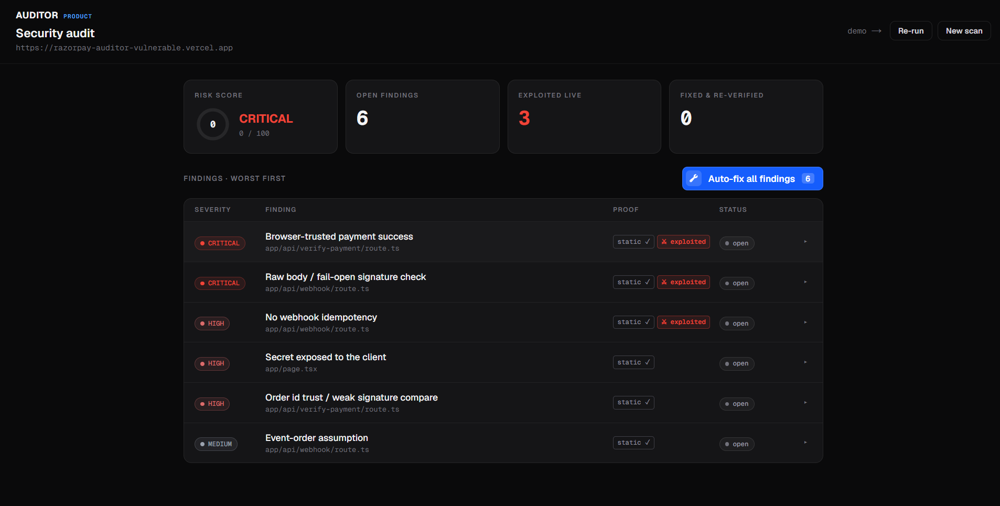
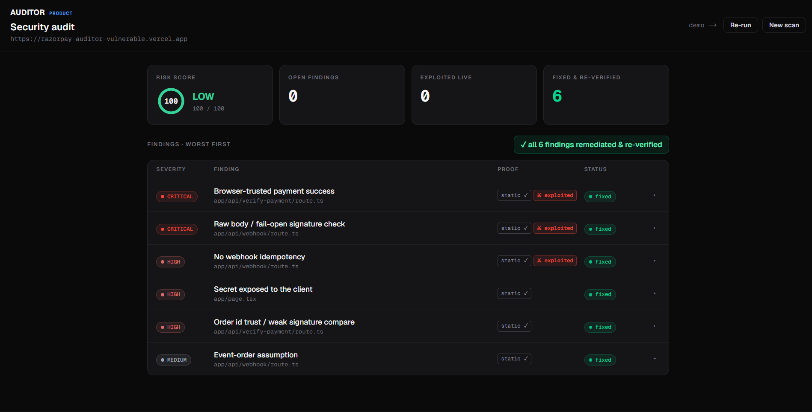
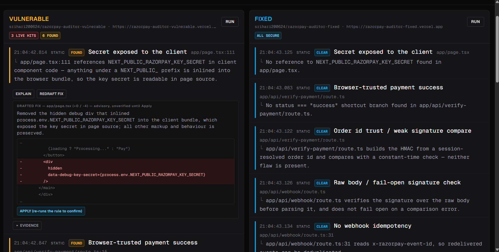
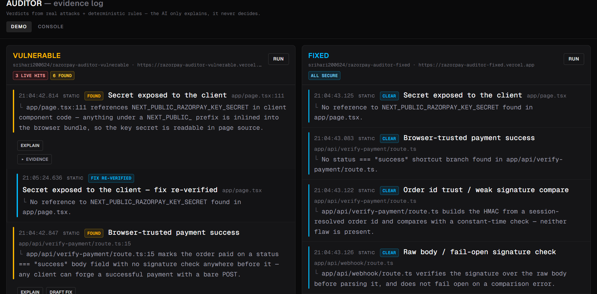
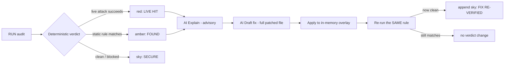
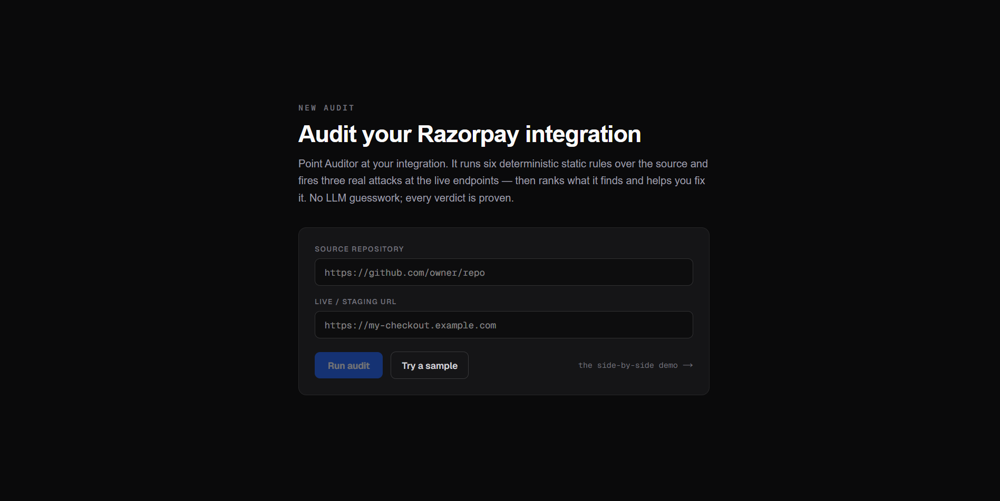

# Auditor — AI Payment Integration Auditor

**Finds and _proves_ security defects in Razorpay payment integrations — by firing real attacks at real endpoints and running deterministic static rules over the source, then drafting a fix and re-verifying it. The AI never decides pass/fail.**

▶ **Live demo:** [side-by-side proof](https://razorpay-auditor.vercel.app/audit) &nbsp;·&nbsp; [audit an integration](https://razorpay-auditor.vercel.app/product)
&nbsp;·&nbsp; Targets: [vulnerable](https://razorpay-auditor-vulnerable.vercel.app) · [fixed](https://razorpay-auditor-fixed.vercel.app)

| Before | After |
|---|---|
|  |  |

<sub><b>The same audit, before and after remediation.</b> Left: 6 open findings, 3 of them <b>exploited live</b> — risk score <b>0 / 100, CRITICAL</b>. Right: after <i>Auto-fix all</i>, every row reads <b>fixed</b> and the score is <b>100 / 100, LOW</b>. A row flips to <code>fixed</code> only after the same deterministic rule that proved the defect is re-run against the patched code and comes back clean — never because the model said it fixed it.</sub>

---

## The idea — proof, not opinion

Most "AI security" tools ask a language model whether code *looks* vulnerable and report its opinion. Auditor doesn't. It reaches a verdict two deterministic ways:

1. **Live attacks** — real HTTP requests fired at a running endpoint. A verdict of "vulnerable" means an attack *actually succeeded* (e.g. an order was marked paid with no valid proof).
2. **Static rules** — deterministic checks over the integration's source.

The LLM is used **only** to _explain_ a finding the engine already proved, and to _draft_ a fix — and every drafted fix is confirmed by **re-running the same real check**, never by the model's say-so. That principle is the whole point:

> **The AI never decides pass/fail.** Verdicts come only from what a real attack does against a real endpoint, and from deterministic rules. The AI explains and drafts; the machine decides.

## How the demo works

Open the [live audit](https://razorpay-auditor.vercel.app/audit), **Demo** tab: two panels, the same Razorpay integration deployed twice — one deliberately broken, one correct. Press **RUN**:

- Every finding lands in the evidence log — **red** = a live attack succeeded, **amber** = a static rule matched, **sky/blue** = verified secure.
- On any red/amber finding: **Explain** (streamed, advisory) → **Draft fix** (a real diff, grounded in the known-good reference) → **Apply**.
- Apply patches an **in-memory copy**, re-runs the real check, and the finding flips **red → blue**. The audited app is never written to.



<sub>The **Demo** tab mid-run. Left, the vulnerable target: <code>3 LIVE HITS · 6 FOUND</code>, with a drafted fix open — a real diff for <code>app/page.tsx</code>, labelled *advisory, unverified until Apply*. Right, the identical-but-correct target: every check <code>CLEAR</code>, each with the reason it passed. Same engine, same run, opposite verdicts.</sub>



<sub>After **Apply**. The rule was re-run against the patched copy and came back clean, so a <code>FIX RE-VERIFIED</code> entry is **appended** beneath the original finding — the amber proof is never rewritten. The log keeps the fact that the target *was* vulnerable next to the proof that the fix holds.</sub>



## The six defects & how each is proven

Three of the six are also provable by a **live attack** (the paired rule and the attack prove the same defect from opposite ends):

| Defect | Static rule | Live attack |
|---|---|---|
| Browser-trusted payment success (`status:"success"` bypass) | `browser-trusted-success` | `fakePaymentSuccess` |
| No webhook idempotency (replay doubles credited ₹) | `no-idempotency` | `webhookReplay` |
| Fail-open webhook signature check | `raw-body-violation` | `forgedSignature` |
| Razorpay key secret exposed to the client bundle | `secret-exposure` | — |
| Order-id trust / non-constant-time signature compare | `order-id-trust` | — |
| Event-order assumption (captured assumes authorized) | `event-order-assumption` | — |

## Two front ends, one engine

`/audit` puts the mechanism on display — an evidence log, verdict by verdict. `/product` is the same six rules and three attacks (the same `useAuditRun` hook, the same API routes — no second engine) reframed as a tool you point at **your own** integration: one row per defect, ranked worst-first, with a risk score derived from what is still open.



Give it a repo and a live URL — or press **Try a sample** to run against the deliberately vulnerable target. Each row expands into the same evidence (the matched source line; for a live attack, the actual requests fired and the order-state trail read back) and the same Explain → Draft fix → Apply flow. **Auto-fix all** loops that flow across every open finding, one at a time; each fix is still verified by its own rule, so the score at the top only moves when a deterministic check says it should.

## The three repos

```
razorpay-auditor            ← this repo: the tool + the /audit UI
razorpay-auditor-vulnerable ← target: the integration with 6 deliberate defects
razorpay-auditor-fixed      ← target: the correct reference (all attacks fail)
```

- Auditor — https://github.com/srihari200624/razorpay-auditor
- Vulnerable — https://github.com/srihari200624/razorpay-auditor-vulnerable
- Fixed — https://github.com/srihari200624/razorpay-auditor-fixed

The vulnerable and fixed apps are structurally identical; every difference between them is a defect, not stylistic drift. That's what lets Auditor demonstrate the exact split: **all attacks succeed against vulnerable, all fail against fixed.**

## Running locally

```bash
npm install
npm run dev        # the app, incl. the /audit console → http://localhost:3000
```

CLI runners (no UI):

```bash
npm run audit -- http://localhost:3000     # fire the 3 live attacks at a target
npm run scan  -- ../fixed                   # run the 6 static rules over a source
#   scan also takes a GitHub URL: npm run scan -- https://github.com/owner/repo
```

### Environment (`.env`, git-ignored)

| Var | Used by | Notes |
|---|---|---|
| `RAZORPAY_WEBHOOK_SECRET` | live attacks (`lib/attacks/`) | test-mode, shared with the target apps |
| `ANTHROPIC_API_KEY` | Explain / Draft-fix routes | without it those two routes return a clean 502; the rest works |
| `LLM_RATE_LIMIT_PER_HOUR` | LLM routes | optional; default 10 req/IP/hr, raise while demoing from one IP |
| `AUDITOR_REFERENCE_SOURCE` | Draft-fix grounding | optional; point the reference corpus at a local `../fixed` instead of GitHub |

## Coverage & honesty

Auditor is deliberately scoped to a **Razorpay Standard Checkout one-time-payment flow**, and the six static rules match specific, high-signal patterns at known route paths (e.g. a `status === "success"` bypass in `verify-payment`, a fail-open `catch` in the webhook handler). They are precise, not a general-purpose scanner — a rule reports a clean CLEAR when its pattern is absent, so it's honest on the fixed app too. The **live attacks** need no source at all; they work against any deployed URL that speaks the same endpoints, which is where the "proof, not opinion" claim is strongest. Extending to new integrations means adding a rule/attack pair per defect class — the engine (`SourceFetcher`, the paired rule/attack matrix, the in-memory overlay + re-verify) is built to take them. See [`ROADMAP.md`](./ROADMAP.md) for the planned sequence — deepening coverage of the existing six, broadening the rules beyond exact file paths, new defect types, and eventually a non-Razorpay integration.

## Tech

Next.js (App Router) · TypeScript · Anthropic API (`claude-opus-4-8` for fix drafting, `claude-sonnet-5` for explanations) · the target apps use Prisma + Postgres and the Razorpay Node SDK. Deployed on Vercel.
